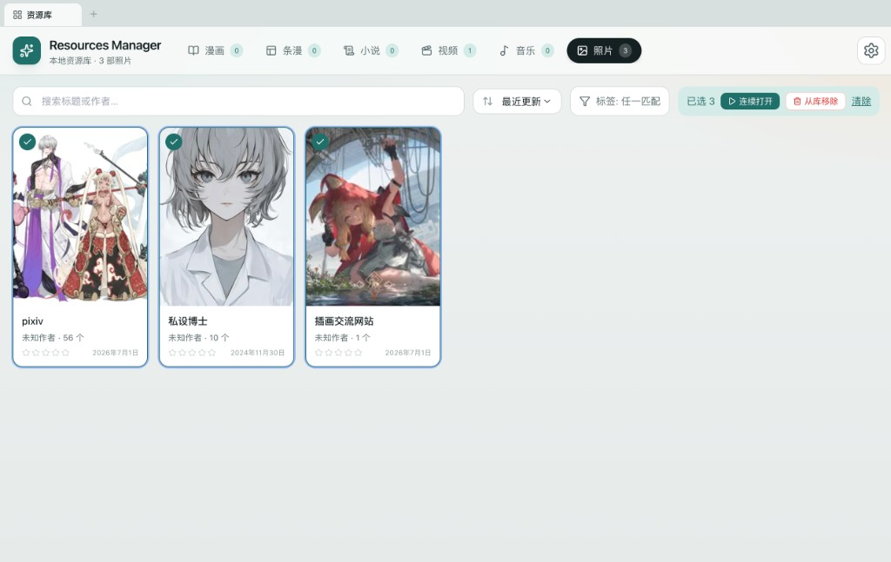
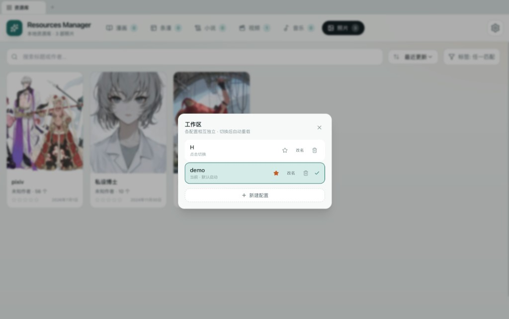

# Resources Manager

本地一体化资源管理器 — 漫画、条漫、小说、视频、音乐与照片，私有、离线、自动整理。

数据只存在本机，不上传云端。

<p align="center">
  
</p>

<p align="center">
  
</p>

---

## 近期更新

- **拍摄日历**：已移除顶部拍摄日历条
- **进度展示**：仅视频显示进度条 / 详情进度；照片与漫画不展示
- **视频按文件夹**：扫描时与照片一致，同一文件夹归为一个系列
- **多选体验**：切换媒体类型清空选择；点空白处退出多选；框选 / ⌘ 多选
- **连续打开**：照片、视频多选后可拼成一条播放队列；视频可批量重置进度
- **从库移除**：只删索引，不删磁盘源文件
- **播放器**：进度条比例修正；截帧弹窗可选「保存到本地」或「设为详情页缩略图」
- **视频缩略图**：内容列表为每个视频生成帧缩略图（macOS Quick Look）
- **界面过渡**：标签切换短时虚化；播放器与详情互斥，避免叠层
- **多工作区**：独立配置；点品牌图标 5 次或 ⌘⇧. 切换

---

## 功能

### 统一资源库
- 六种类型：漫画 / 条漫 / 小说 / 视频 / 音乐 / 照片
- 标题栏切换类型；搜索、标签、排序
- 浏览器式多标签：可同时打开多个系列，各自保留滚动位置

### 导入与整理
- 访达选文件夹 · 递归扫描 · 导入后懒生成缩略图
- `[作者] 标题` 等命名解析；漫画话数文件夹自动归入系列
- **照片 / 视频按文件夹为单位**建系列（每个文件夹一张卡片）
- 重复添加同一路径会复用并重新扫描

### 阅读与播放
- 漫画 / 条漫：zip·cbz、动图、放映（精确间隔）、全屏与页码
- 小说：TXT 多编码、EPUB、PDF
- 视频：进度续播、快捷键、A-B、截帧设封面；多选连续播放与批量重置进度
- 照片：多选连续打开（上一相册结束后接下一个）
- 音乐：底部 Dock 跨页续播

### 多工作区（隐私）
- 独立配置互不影响；隐蔽入口切换（点品牌图标 5 次，或 ⌘⇧.）
- 可设默认启动配置

### 数据
- SQLite 本地库 · 标签 / 评分 · 视频进度 · 备份恢复

### 桌面
- `npm run resources` 内置窗口（关窗停服）
- `npm run release:mac` 打 macOS arm64 安装包

---

## 快速开始

```bash
npm install
npm run resources
```

或双击 `scripts/Start Resources Manager.command`。

设置 → 访达选择文件夹 → 添加并扫描。

已有按「单文件一张卡片」导入的视频，请对视频库 **重新扫描**，才会按文件夹重组。

### 多选操作（照片 / 视频）
- 空白处拖拽框选；点空白单击清除选择
- ⌘/Ctrl 点击、右键或左上角勾选
- 工具栏 **连续打开**：所选系列拼成一条播放队列
- 视频另有 **重置进度**；**从库移除** 不删源文件

---

## 技术栈

Next.js 15.1.6 · React 19 · TypeScript · Tailwind · better-sqlite3 · sharp · Electron（可选打包）

数据目录：开发为 `./data/profiles/<配置>/`；桌面端在应用支持目录下。

---

## License

Private / 个人使用。
