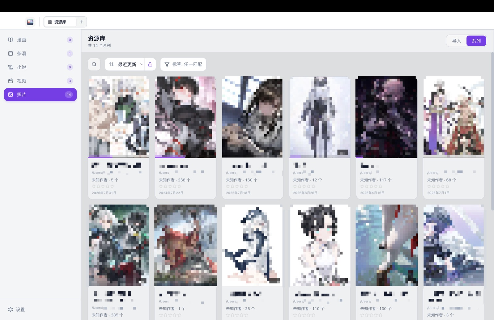
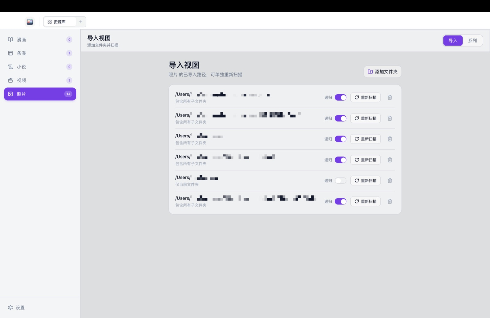
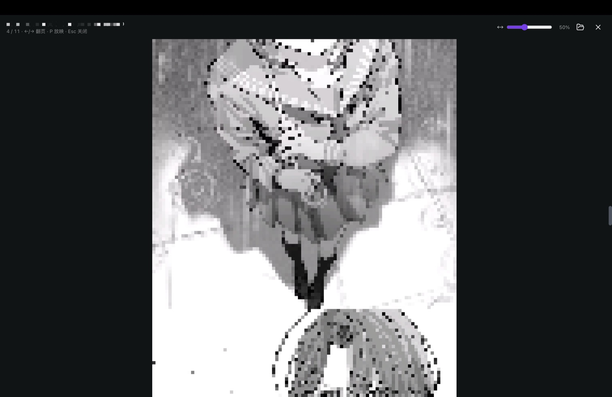
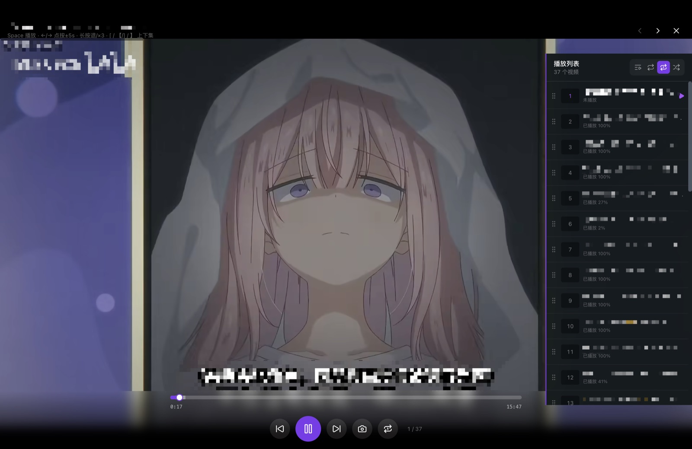
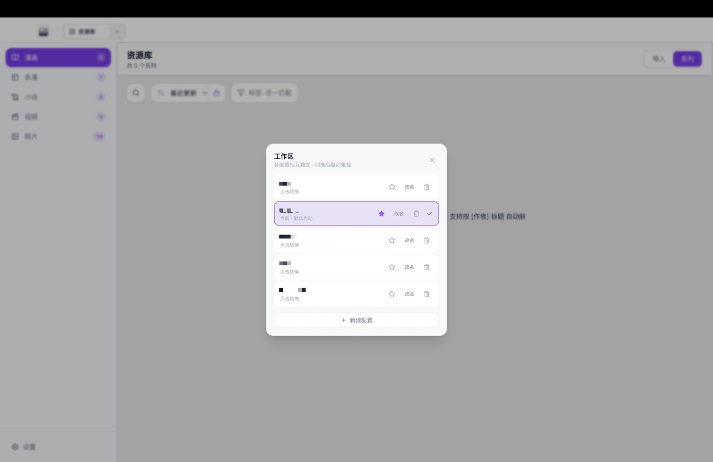

# Resources Manager

面向本地文件的媒体资源库。把漫画、条漫、小说、视频和照片按文件夹整理，在同一个桌面窗口中查找、阅读与播放。导入和分组只维护资源库索引，不搬动原文件。



## 开始使用

目前提供 macOS Apple Silicon 安装包；已发布的版本可在 [GitHub Releases](https://github.com/JerryDoko/Resources_manager/releases) 下载。安装后添加文件夹，即可建立资源库。

从源码运行需要 Node.js 20 和 npm：

```bash
npm ci
npm run resources
```

`npm run resources` 会启动服务并打开 Electron 内置窗口。macOS 也可以双击 `scripts/Start Resources Manager.command`。若只需要系统浏览器，可运行 `npm run resources:web`。

## 导入与整理

- 按漫画、条漫、小说、视频、照片五种类型添加文件夹；导入时可选择递归扫描子文件夹或只扫描当前文件夹，默认递归。
- 每条导入路径可单独调整递归范围、重新扫描或从库中移除。再次扫描会复用已收录文件，不会因重复导入而生成重复项。
- 视频和照片按文件夹归为系列。打开照片文件夹时会检查新增图片并自动导入。
- 在文件夹内多选文件，可创建逻辑分组，或移动到同类型的已有分组；磁盘上的文件位置保持不变。



## 浏览资源库

- 资源库支持搜索、标签筛选、评分和排序；大量内容分批加载，返回资源库时保留原有滚动位置。
- 文件夹内可按名称、添加日期或修改日期排序，再次点击同一字段切换正序与倒序。每个文件夹可以单独锁定排序字段和方向；未锁定时默认按名称正序。
- 文件夹内容支持按名称、路径、日期的包含搜索，以及按评分筛选。打开筛选后的文件时，阅读或播放队列遵循当前筛选结果与排序。
- 支持多标签页、项目评分、标签、缩略图和内容详情。将项目从资源库移除只删除索引，不删除源文件。


## 阅读与播放

**漫画与条漫**：浏览图片文件夹或 ZIP/CBZ 内容；条漫可向下连续阅读文件夹中的图片，宽度滑块默认 50%，并记住调整后的宽度。图片可从阅读器中定位到访达中的原文件。



**小说**：支持 TXT、EPUB、PDF。EPUB 可显示章节中的图片，并在滚动到章节边界后继续切换章节。

**视频**：记录播放进度，下次打开从上次位置继续，也可手动重置。全屏播放器提供进度、快捷键和截帧；播放列表可调整顺序，并选择顺序播放、列表循环、单曲循环或随机播放。




## 多工作区

不同工作区使用独立的资源库数据库、缩略图和设置。可创建、重命名、删除工作区，并指定默认启动工作区。点击标题栏左侧图标五次，或按 `⌘⇧.`（Windows/Linux 为 `Ctrl+Shift+.`）打开切换界面。



## AI 控制与更新

在设置中启用 AI 控制后，可为本机接口生成令牌并设置权限：

| 权限 | 可用动作 |
| --- | --- |
| 读取级 | 搜索资源库、查看系列和统计、读取标签 |
| 可恢复级 | 调整评分和排序、添加标签、识别图片并为所在系列打标签 |
| 危险级 | 重置进度、从资源库移除系列；执行前须在应用内确认 |

识图需要自行配置兼容 OpenAI Chat Completions 的视觉模型地址、模型和密钥。仓库中的 `plugins/resources-manager` 提供本地 MCP 接入；应用运行且 AI 控制启用后，插件会连接本机服务，仍受上述权限限制。

在本仓库根目录安装 Codex 插件：

```bash
codex plugin marketplace add "$(pwd)"
codex plugin add resources-manager@personal
```

安装后在新对话中启用 Resources Manager 插件。危险动作仍需回到应用窗口确认。

设置页可手动检查 GitHub 更新；发现新版本时也会显示更新提醒。更新检查不会自动安装新版本。

## 数据与隐私

- 资源库索引、评分、标签、进度和设置保存在本机 SQLite 中；设置页支持导出与恢复备份。
- 开发运行时数据默认位于 `data/profiles/<配置 ID>/`；打包应用的数据位于 macOS 应用支持目录。可用 `RESOURCES_MANAGER_DATA` 指定数据根目录。
- 常规导入和浏览不需要云服务。检查更新会访问 GitHub；使用 AI 识图时，选中的图片会发送到你配置的视觉模型服务。未启用 AI 时不会执行识图请求。
- 安装包采用 ad-hoc 签名，尚未经过 Apple 公证；macOS 可能提示安全确认。

## 开发与打包

```bash
npm run build        # 构建应用
npm run release:mac  # 生成 macOS arm64 DMG 和 ZIP
```

主要技术：Next.js 15、React 19、TypeScript、Electron、SQLite、sharp。打包产物输出到 `release/`。
